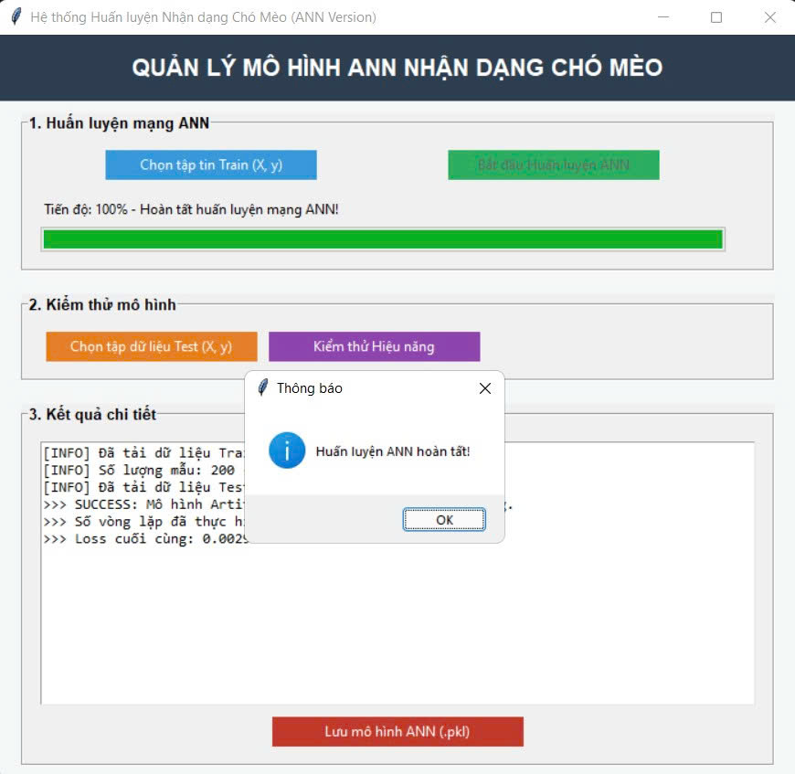
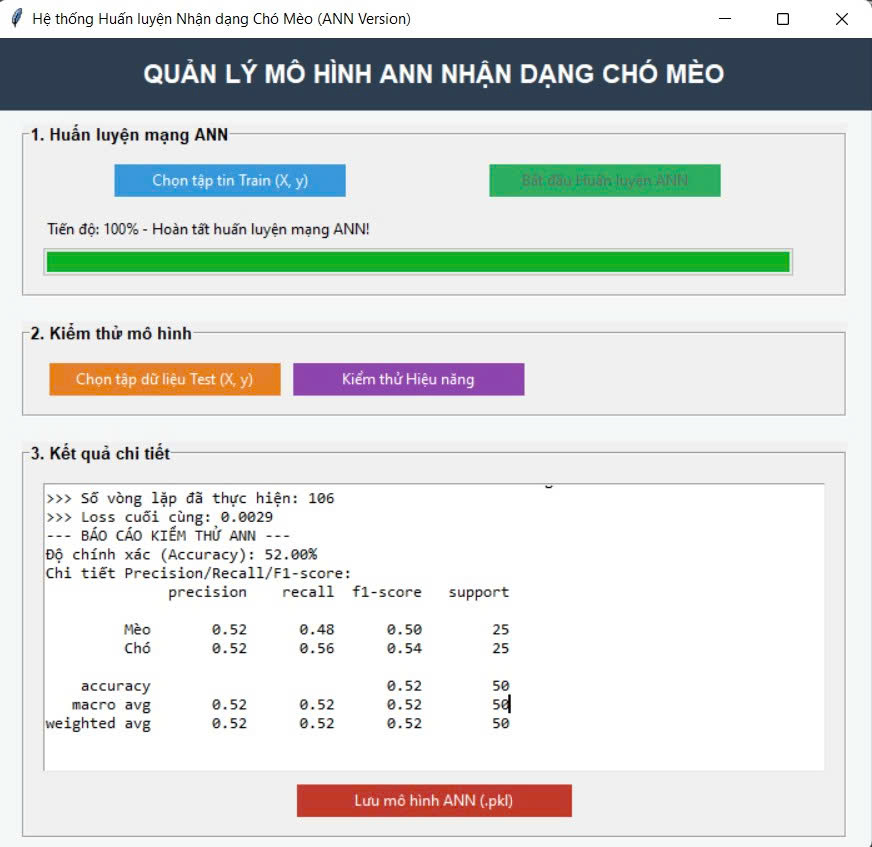
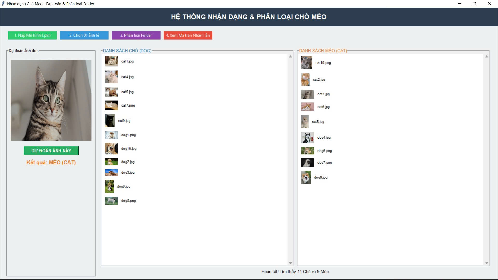
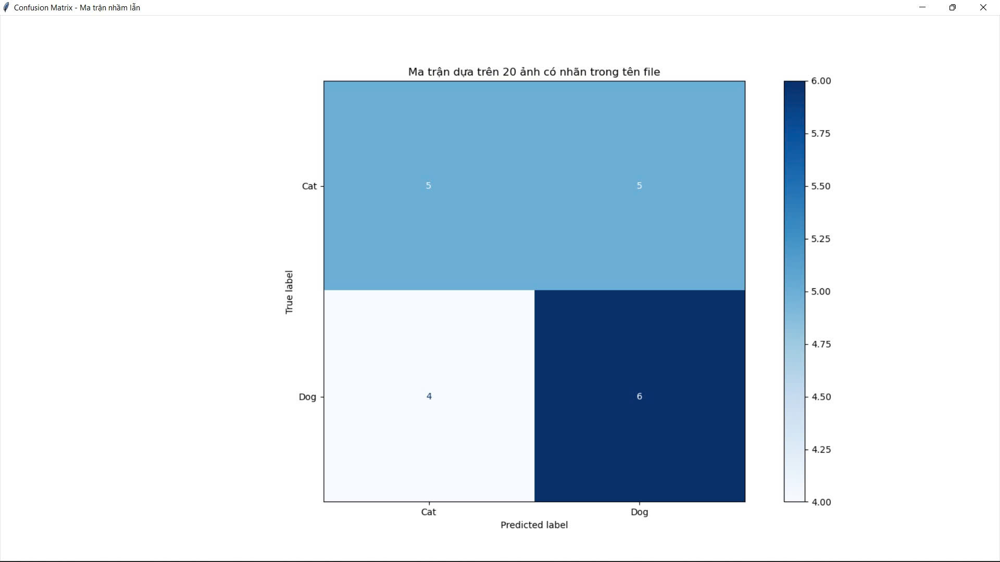

## Giao diện chương trình:

## App huấn luyện mô hình ANN nhận dạng chó mèo, có các chức năng:
- Tải tệp train, test từ máy.
- Huấn luyện mô hình.
- Kiểm thử hiệu năng (Accuracy, Precision, Recall, F1,...)
- Lưu mô hình.

<table>
  <tr>
    <td>
      
    </td>
  </tr>
</table>

<table>
  <tr>
    <td>
      
    </td>
  </tr>
</table>

## App nhận dạng chó mèo, có các chức năng:
- Nạp file mô hình.
- Dự đoán chó/mèo dựa trên 1 ảnh bất kỳ tải từ máy.
- Dự đoán và phân loại chó/mèo dựa trên folder tải từ máy.
- Vẽ confusion matrix với tên file ảnh có bao gồm tên nhãn là 'dog' hoặc 'cat'.

<table>
  <tr>
    <td>
      
    </td>
  </tr>
</table>

## Ma trận nhầm lẫn:

<table>
  <tr>
    <td>
      
    </td>
  </tr>
</table>
